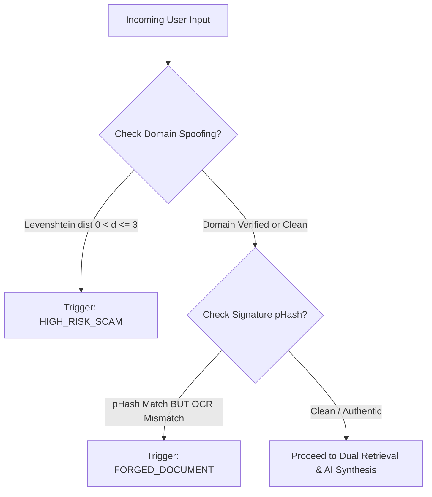

# 1. Dynamic Algorithm Specification

This document details the multi-modal ingestion, dynamic live retrieval, evidence aggregation, scoring rules, and hard triggers for the **VeriFeed Malawian Information Verification, Truth Engine, and Fraud Prevention Platform**.

---

## 1.1 Multi-Modal Ingestion & Preprocessing

When a user submits a prompt, text claim, screenshot/PDF document, or audio voice note, the request enters a multi-stream ingestion and feature extraction layer:

```
                          ┌───────────────────────────────┐
                          │    User Input Submission      │
                          │  (Text / Screenshot / Voice)  │
                          └───────────────┬───────────────┘
                                          │
            ┌─────────────────────────────┼─────────────────────────────┐
            ▼                             ▼                             ▼
┌───────────────────────┐     ┌───────────────────────┐     ┌───────────────────────┐
│ Text & Shortlinks     │     │ Visual & Forensics    │     │ Audio Processing      │
│ • Regex Extraction    │     │ • OCR (Tesseract)     │     │ • OpenAI / Whisper    │
│ • Domain Roots        │     │ • Signature Bounding  │     │ • Code-Switching      │
│ • Phone Numbers       │     │   Box Isolation       │     │   (Chichewa/English)  │
│ • Named Entities      │     │ • Perceptual Hash     │     │ • Normalized Text     │
└───────────┬───────────┘     └───────────┬───────────┘     └───────────┬───────────┘
            │                             │                             │
            └─────────────────────────────┼─────────────────────────────┘
                                          │
                                          ▼
                          ┌───────────────────────────────┐
                          │   Normalized Claims Context   │
                          └───────────────────────────────┘
```

### Multi-Stream Breakdown

1. **Text & Shortlink Extraction:**
   - Parses URLs, extracted domain roots, and phone numbers.
   - Isolates Malawian Named Entities (e.g., *"Mayor of Blantyre"*, *"Mtukula Pakhomo"*, *"TNM Kuwina"*, *"Ministry of Finance"*, *"RBM"*).
   - Resolves redirected URL shorteners (`bit.ly`, `tinyurl.com`, `t.co`, `rb.gy`, `cutt.ly`).

2. **Visual & Document Forensics (OCR & pHash):**
   - Processes uploaded screenshots, notices, or press release PDFs via **OCR** (Tesseract / Vision AI) to extract plain text body content.
   - Isolates bounding boxes around official crests, ministry seals, or official signatures.
   - Computes a 64-bit **Perceptual Hash (pHash)** of isolated seals/signatures to detect document forgery or unauthorized seal re-use.

3. **Audio Processing (Whisper STT):**
   - Transcribes audio voice notes and recorded clips using **Whisper Speech-to-Text (STT)**.
   - Intelligently processes code-switching between **English** and **Chichewa** (*"Boma lanena kuti..."* / *"Free airtime promotion..."*).
   - Produces clean, normalized text appended to the reasoning context stream.

---

## 1.2 Dual Live Retrieval & Source-of-Truth Aggregation

To avoid relying on static parametric memory or hallucinated answers, VeriFeed queries live, verified ground-truth repositories in real time:

```
                  ┌───────────────────────────────┐
                  │      User Submitted Prompt    │
                  └───────────────┬───────────────┘
                                  │
                  ┌───────────────┴───────────────┐
                  │    Dynamic Search Generator   │
                  └───────────────┬───────────────┘
                                  │
        ┌─────────────────────────┼─────────────────────────┐
        ▼                         ▼                         ▼
┌────────────────────────┐ ┌────────────────────────┐ ┌────────────────────────┐
│ Whitelisted Live Web   │ │ Vector DB (Pgvector)   │ │ Meta Live Ingestor     │
│ Scoped to:             │ │ Recently Indexed:      │ │ Real-time from:        │
│ • times.mw, mbc.mw     │ │ • Ministry Notices     │ │ • Facebook Webhooks    │
│ • malawi24.com         │ │ • Telecom Tariffs      │ │   (RBM, MRA, ACB, TNM) │
│ • zodiak.mw, gov.mw    │ │ • Press Releases       │ │ • WhatsApp Tipline     │
│ • tnm.co.mw, airtel.mw │ │ • Official Alerts      │ │   (User Submissions)   │
│                        │ │                        │ │ • RSS Bridge Fallback  │
│                        │ │                        │ │   (every 5 min Celery) │
└────────────┬───────────┘ └────────────┬───────────┘ └────────────┬───────────┘
             │                          │                          │
             └──────────────────────────┼──────────────────────────┘
                                        │
                                        ▼
                  ┌───────────────────────────────┐
                  │   Combined Evidence Context   │
                  └───────────────────────────────┘
```

> See `meta_integration.md` for the full Facebook Webhook and WhatsApp Bot implementation.

---

## 1.3 Scoring & Decision Rules

VeriFeed calculates the overall weighted confidence score $S$ across four core analytical dimensions:

$$S = w_1 S_{\text{domain}} + w_2 S_{\text{vector}} + w_3 S_{\text{forensic}} + w_4 S_{\text{telecom}}$$

### Component Weight Breakdown

| Component | Weight | Description | Scoring Range |
| :--- | :--- | :--- | :--- |
| $S_{\text{domain}}$ | $w_1 = 0.35$ | Source Domain Trust & Lookalike Analysis | $1.0$ (Government/Regulatory), $0.85$ (Media), $0.0$ (Spoofed/Unverified) |
| $S_{\text{vector}}$ | $w_2 = 0.35$ | Cosine Similarity against Pgvector Ground-Truth | $0.0 \le S_{\text{vector}} \le 1.0$ |
| $S_{\text{forensic}}$ | $w_3 = 0.20$ | pHash Signature Seal & Image Authenticity Integrity | $1.0 - \frac{\text{HammingDistance}}{64}$ |
| $S_{\text{telecom}}$ | $w_4 = 0.10$ | Telecom Sender ID & Phone Blacklist Matching | $1.0$ (Registered Official), $0.0$ (Scam Registry Match) |

> [!IMPORTANT]
> **Total Weights Sum Rule:** $w_1 + w_2 + w_3 + w_4 = 0.35 + 0.35 + 0.20 + 0.10 = 1.00$.

---

## 1.4 Hard Triggers & Immediate Fast-Exit Rules

Before invoking LLM synthesis, deterministic hard triggers evaluate inputs to protect users from high-risk scams and forged government documents:



### Rule 1: Lookalike Domain / Spoof URL
If the string distance (Levenshtein distance $d$) between an extracted URL domain and official domains (`tnm.co.mw`, `airtel.mw`, `gov.mw`, `macra.mw`, `times.mw`, `mbc.mw`, `malawi24.com`, `zodiak.mw`, `zodiakmalawi.com`) satisfies:

$$0 < d \le 3 \quad \text{or contains keywords} \quad \{\text{"promo"}, \text{"win"}, \text{"claim"}, \text{"bonus"}\}$$

$\Longrightarrow$ **Immediately trigger `HIGH_RISK_SCAM` verdict with confidence $S = 1.00$.**

### Rule 2: Forged Signature / Fraudulent Crest
If the computed perceptual hash (pHash) of an isolated signature or official seal matches a known official signature template in `signature_fingerprints` (Hamming distance $\le 8$), but the surrounding OCR text body does **not** match any indexed ground-truth document associated with that signature ID:

$\Longrightarrow$ **Immediately trigger `FORGED_DOCUMENT` verdict.**
