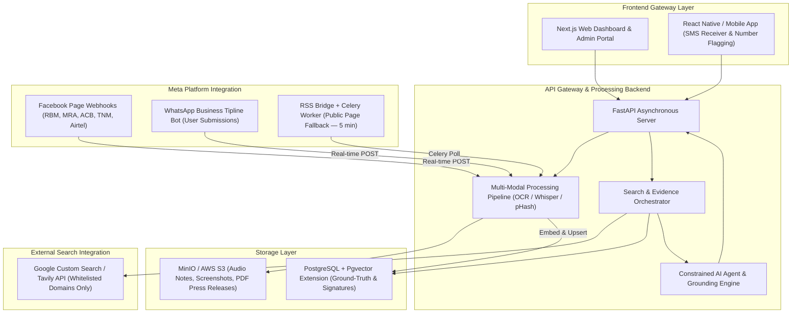

# 2. System Blueprint & Component Map

This document outlines the system architecture, core service tiers, component interactions, and relational/vector database schemas for the **VeriFeed Malawian Information Verification, Truth Engine, and Fraud Prevention Platform**.

---

## 2.1 Core Services Architecture



### Component Details

1. **Frontend Gateway:**
   - **Next.js Web Dashboard & Admin Portal:** Modern web application featuring reactive verification search, institutional portal, verification logs, and admin management.
   - **React Native / Mobile App:** Android mobile companion featuring SMS broadcast listener, call/number flagging, and background threat screening.

2. **API Gateway & Processing Backend:**
   - **FastAPI Asynchronous Server:** High-performance Python backend serving RESTful endpoints (`/api/v1/verify`, `/api/v1/screen`, `/api/v1/stories`).
   - **Multi-Modal Pipeline:** Hosts Tesseract OCR, Whisper STT model, regex parsing, and Levenshtein domain distance checkers.
   - **Agent Reasoning Engine:** Interacts with Google Gemini / OpenAI models, enforcing hard systemic guardrails against parametric memory hallucination.

3. **Storage Layer:**
   - **Pgvector (PostgreSQL):** Stores 1536-dimensional vector embeddings of press releases, official notices, trust tier domain mappings, signature pHashes, and community scam registries.
   - **MinIO / AWS S3:** Secure object store for uploaded audio voice notes, raw PDF press releases, and scam screenshots.

4. **External Search Integration:**
   - **Google Custom Search API / Tavily API:** Queries restricted live web search indexes limited exclusively to whitelisted Malawian domains (`times.mw`, `mbc.mw`, `malawi24.com`, `zodiak.mw`, `gov.mw`, `macra.mw`, `tnm.co.mw`, `airtel.mw`).

5. **Meta Platform Integration** *(see `meta_integration.md` for full implementation):*
   - **Facebook Page Webhooks:** Real-time POST ingestion from official Malawian institution pages (RBM, MRA, ACB, TNM, Airtel, Police). Each new post is embedded via `embed_text()` and upserted into the Pgvector ground-truth store within seconds of publication.
   - **RSS Bridge + Celery Worker:** Fallback for pages without admin Page Access Tokens. RSS Bridge converts public Facebook Page timelines into Atom feeds; a Celery beat task polls every 5 minutes and ingests new posts.
   - **WhatsApp Business Tipline Bot:** Users forward suspicious messages, voice notes, or screenshots to the VeriFeed WhatsApp number. Audio is processed through Whisper STT; images through Tesseract OCR. The bot replies with a verdict, summary, and evidence links in under 10 seconds.

---

## 2.2 Relational & Vector Database Schema

```sql
-- Pgvector Extension Enablement
CREATE EXTENSION IF NOT EXISTS vector;

-- Whitelisted & Trust Registry
CREATE TABLE trust_sources (
    id UUID PRIMARY KEY DEFAULT gen_random_uuid(),
    source_name VARCHAR(255) NOT NULL,
    domain_name VARCHAR(255) UNIQUE NOT NULL,
    trust_tier FLOAT NOT NULL DEFAULT 0.85 -- 1.0 = Ministry/Official, 0.85 = Media
);

-- Ground Truth Vector Store
CREATE TABLE ground_truth_embeddings (
    id UUID PRIMARY KEY DEFAULT gen_random_uuid(),
    source_id UUID REFERENCES trust_sources(id),
    title VARCHAR(500) NOT NULL,
    content TEXT NOT NULL,
    source_url TEXT UNIQUE NOT NULL,
    publication_date TIMESTAMP WITH TIME ZONE,
    embedding vector(1536)
);

-- Official Signature Fingerprints
CREATE TABLE signature_fingerprints (
    id UUID PRIMARY KEY DEFAULT gen_random_uuid(),
    official_title VARCHAR(255) NOT NULL, -- e.g. "Secretary to the President"
    phash_value VARCHAR(64) NOT NULL,
    associated_doc_id UUID REFERENCES ground_truth_embeddings(id)
);

-- Scam Phone Numbers & Lookalike Domains
CREATE TABLE scam_registry (
    id UUID PRIMARY KEY DEFAULT gen_random_uuid(),
    entity_value VARCHAR(255) UNIQUE NOT NULL, -- Phone number or domain
    entity_type VARCHAR(50) NOT NULL, -- 'PHONE' or 'DOMAIN'
    risk_score FLOAT DEFAULT 1.0,
    report_count INT DEFAULT 1
);
```
