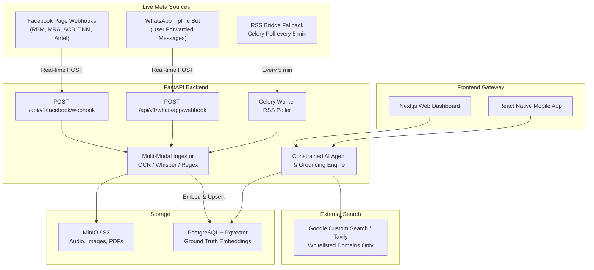

# 6. Meta Platform Integration — Facebook & WhatsApp Live Data

This document covers every architectural path for pulling **real-time live data** from Meta's platforms (Facebook and WhatsApp) into the VeriFeed evidence pipeline. It is designed to feed the **Pgvector ground-truth store** and the **live retrieval layer** described in `algorithm.md` and `blueprint.md`.

---

## 6.1 Why This Matters

VeriFeed's verdict quality depends directly on the freshness and authority of its indexed evidence. Official Malawian institutions — **Reserve Bank of Malawi (RBM)**, **Malawi Revenue Authority (MRA)**, **TNM**, **Airtel Malawi**, **MACRA**, **ACB**, and government MDAs — publish real-time warnings, fraud alerts, monetary policy statements, and press releases **primarily on Facebook** before they appear on their own websites.

Without live Meta ingestion, a scam disclaimer posted by RBM at 09:00 AM may not reach VeriFeed's knowledge base until a human manually indexes it hours later — during which time thousands of users could be defrauded.

---

## 6.2 Data Sources & Target Pages

| Institution | Facebook Page | Priority | Content Type |
|:---|:---|:---|:---|
| Reserve Bank of Malawi | `/ReserveBankMalawi` | 🔴 Critical | Fraud warnings, exchange rates, policy statements |
| Malawi Revenue Authority | `/MalawiRevenueAuthority` | 🔴 Critical | Tax scam alerts, official deadlines |
| Anti-Corruption Bureau (ACB) | `/ACBMalawi` | 🔴 Critical | Impersonation warnings, investigation notices |
| TNM Malawi | `/TNMMalawi` | 🟠 High | Promo verifications, SIM swap fraud |
| Airtel Malawi | `/AirtelMalawi` | 🟠 High | Mobile money scam disclaimers |
| MACRA | `/MacraMalawi` | 🟠 High | Unlicensed operator warnings |
| Malawi Police Service | `/MalawiPoliceService` | 🟠 High | Crime alerts, arrest notices |
| Ministry of Finance | `/MalawiMinistryOfFinance` | 🟡 Medium | Budget, loan program announcements |
| Times 360 Malawi | `/Times360Malawi` | 🟡 Medium | Breaking news |
| Zodiak Broadcasting | `/ZodiakOnline` | 🟡 Medium | Breaking news |
| Malawi 24 | `/Malawi24` | 🟡 Medium | Breaking news |

---

## 6.3 Facebook Integration: Two Paths

### Path A — Meta Graph API + Webhooks (Recommended for Official Partners)

This is the **real-time, low-latency** method. You register a webhook with Meta that receives a `POST` payload within seconds of any new page post.

#### Prerequisites

1. Create a **Meta for Developers** app at [developers.facebook.com](https://developers.facebook.com)
2. Add the **Webhooks** and **Pages** products to your app
3. Obtain a **Page Access Token** for each target page (requires page admin permission, or use the Meta Business API for institutional partnerships)
4. Register your FastAPI webhook endpoint with Meta

#### FastAPI Webhook Endpoint

```python
# apps/api/app/routers/facebook_webhook.py

from fastapi import APIRouter, Request, HTTPException, Query, BackgroundTasks
from app.services.ingestor import ingest_facebook_post
import os

router = APIRouter(prefix="/api/v1/facebook", tags=["Facebook Integration"])

VERIFY_TOKEN = os.getenv("FACEBOOK_WEBHOOK_VERIFY_TOKEN")  # Set in .env


# Step 1: Meta one-time verification handshake
@router.get("/webhook")
async def verify_webhook(
    mode: str = Query(..., alias="hub.mode"),
    token: str = Query(..., alias="hub.verify_token"),
    challenge: str = Query(..., alias="hub.challenge"),
):
    if mode == "subscribe" and token == VERIFY_TOKEN:
        return int(challenge)
    raise HTTPException(status_code=403, detail="Webhook verification failed")


# Step 2: Live post ingestion
@router.post("/webhook")
async def receive_page_post(request: Request, background_tasks: BackgroundTasks):
    data = await request.json()
    for entry in data.get("entry", []):
        page_id = entry.get("id")
        for change in entry.get("changes", []):
            if change.get("field") == "feed":
                value = change["value"]
                post_text = value.get("message", "")
                post_id = value.get("post_id", "")
                post_url = f"https://www.facebook.com/{post_id}"
                if post_text:
                    background_tasks.add_task(
                        ingest_facebook_post,
                        content=post_text,
                        url=post_url,
                        page_id=page_id,
                    )
    return {"status": "ok"}
```

#### Ingestor Service

```python
# apps/api/app/services/ingestor.py

from app.services.embeddings import embed_text
from app.models import GroundTruthEmbedding
import logging

logger = logging.getLogger(__name__)

PAGE_ID_TO_SOURCE = {
    "ReserveBankMalawi":       {"name": "Reserve Bank of Malawi",        "tier": 1.0},
    "MalawiRevenueAuthority":  {"name": "Malawi Revenue Authority (MRA)","tier": 1.0},
    "ACBMalawi":               {"name": "Anti-Corruption Bureau (ACB)",  "tier": 1.0},
    "TNMMalawi":               {"name": "TNM Malawi",                    "tier": 0.90},
    "AirtelMalawi":            {"name": "Airtel Malawi",                 "tier": 0.90},
    "MacraMalawi":             {"name": "MACRA",                         "tier": 1.0},
    "MalawiPoliceService":     {"name": "Malawi Police Service",         "tier": 0.95},
    "Times360Malawi":          {"name": "Times 360 Malawi",              "tier": 0.85},
    "ZodiakOnline":            {"name": "Zodiak Broadcasting Station",   "tier": 0.85},
    "Malawi24":                {"name": "Malawi 24",                     "tier": 0.85},
}


async def ingest_facebook_post(content: str, url: str, page_id: str):
    source = PAGE_ID_TO_SOURCE.get(page_id)
    if not source:
        logger.warning(f"Unknown page_id: {page_id}")
        return
    embedding = await embed_text(content)
    # upsert into Pgvector ground_truth_embeddings table
    # ... (use your existing SQLAlchemy session pattern)
    logger.info(f"Ingested: {source['name']} — {url}")
```

#### Subscribe Pages via Graph API

After verification, call this for each page:

```bash
curl -X POST \
  "https://graph.facebook.com/v19.0/{page-id}/subscribed_apps" \
  -d "subscribed_fields=feed" \
  -d "access_token={PAGE_ACCESS_TOKEN}"
```

---

### Path B — RSS Bridge + Celery (Fallback, No Admin Access Needed)

For public pages where you cannot get a Page Access Token, use **RSS Bridge** to generate an RSS feed from the page timeline, polled every 5 minutes by a Celery worker.

```bash
# Deploy RSS Bridge
docker run -p 3000:80 rssbridge/rss-bridge:latest
```

```python
# apps/api/app/tasks/rss_ingestor.py

from celery import Celery
from celery.schedules import crontab
import feedparser
from app.services.ingestor import ingest_facebook_post

celery_app = Celery("verifeed", broker="redis://localhost:6379/0")

RSS_FEEDS = {
    "ReserveBankMalawi":      "http://rss-bridge:3000/?action=display&bridge=Facebook&context=User&u=ReserveBankMalawi&format=Atom",
    "MalawiRevenueAuthority": "http://rss-bridge:3000/?action=display&bridge=Facebook&context=User&u=MalawiRevenueAuthority&format=Atom",
    "ACBMalawi":              "http://rss-bridge:3000/?action=display&bridge=Facebook&context=User&u=ACBMalawi&format=Atom",
    "TNMMalawi":              "http://rss-bridge:3000/?action=display&bridge=Facebook&context=User&u=TNMMalawi&format=Atom",
    "AirtelMalawi":           "http://rss-bridge:3000/?action=display&bridge=Facebook&context=User&u=AirtelMalawi&format=Atom",
    "ZodiakOnline":           "http://rss-bridge:3000/?action=display&bridge=Facebook&context=User&u=ZodiakOnline&format=Atom",
    "Times360Malawi":         "http://rss-bridge:3000/?action=display&bridge=Facebook&context=User&u=Times360Malawi&format=Atom",
}


@celery_app.task
def poll_all_rss_feeds():
    for page_id, feed_url in RSS_FEEDS.items():
        try:
            feed = feedparser.parse(feed_url)
            for entry in feed.entries[:5]:
                content = entry.get("summary") or entry.get("title", "")
                url = entry.get("link", "")
                if content:
                    ingest_facebook_post(content=content, url=url, page_id=page_id)
        except Exception as e:
            print(f"[RSS Poller] Failed for {page_id}: {e}")


celery_app.conf.beat_schedule = {
    "poll-facebook-rss-every-5-min": {
        "task": "app.tasks.rss_ingestor.poll_all_rss_feeds",
        "schedule": crontab(minute="*/5"),
    },
}
```

---

## 6.4 WhatsApp Integration: Two Channels

### Channel 1 — Inbound User Tipline Bot

Users forward suspicious messages, voice notes, or screenshots to the VeriFeed WhatsApp Business number. The bot verifies and replies instantly.

```
[ User forwards suspicious message / voice note / screenshot ]
                        │
                        ▼
         POST /api/v1/whatsapp/webhook
                        │
         ┌──────────────┼──────────────────┐
         ▼              ▼                  ▼
      [Text]         [Audio]           [Image]
         │         Whisper STT       Tesseract OCR
         └──────────────┼──────────────────┘
                        │
              VeriFeed Verification Engine
                        │
              WhatsApp Reply → User
              • Verdict badge
              • Summary paragraph
              • 1–3 evidence URLs
              • Safe action steps
```

#### FastAPI WhatsApp Webhook

```python
# apps/api/app/routers/whatsapp_webhook.py

from fastapi import APIRouter, Request, Query, HTTPException, BackgroundTasks
from app.services.whatsapp_bot import process_whatsapp_message
import os, httpx

router = APIRouter(prefix="/api/v1/whatsapp", tags=["WhatsApp Integration"])

VERIFY_TOKEN = os.getenv("WHATSAPP_WEBHOOK_VERIFY_TOKEN")
WABA_TOKEN   = os.getenv("WHATSAPP_BUSINESS_API_TOKEN")
PHONE_ID     = os.getenv("WHATSAPP_PHONE_NUMBER_ID")


@router.get("/webhook")
async def verify_whatsapp_webhook(
    mode: str = Query(..., alias="hub.mode"),
    token: str = Query(..., alias="hub.verify_token"),
    challenge: str = Query(..., alias="hub.challenge"),
):
    if mode == "subscribe" and token == VERIFY_TOKEN:
        return int(challenge)
    raise HTTPException(status_code=403, detail="Verification failed")


@router.post("/webhook")
async def receive_whatsapp_message(request: Request, background_tasks: BackgroundTasks):
    data = await request.json()
    for entry in data.get("entry", []):
        for change in entry.get("changes", []):
            for message in change.get("value", {}).get("messages", []):
                background_tasks.add_task(
                    process_whatsapp_message,
                    message=message,
                    sender_phone=message.get("from"),
                    msg_type=message.get("type"),
                )
    return {"status": "ok"}


async def send_whatsapp_reply(to: str, text: str):
    async with httpx.AsyncClient() as client:
        await client.post(
            f"https://graph.facebook.com/v19.0/{PHONE_ID}/messages",
            json={"messaging_product": "whatsapp", "to": to, "type": "text", "text": {"body": text}},
            headers={"Authorization": f"Bearer {WABA_TOKEN}"},
        )
```

#### WhatsApp Bot Service

```python
# apps/api/app/services/whatsapp_bot.py

from app.services.verification_agent import run_verification
from app.routers.whatsapp_webhook import send_whatsapp_reply
from app.services.audio_processor import transcribe_audio_url
from app.services.ocr_processor import ocr_image_url


async def process_whatsapp_message(message: dict, sender_phone: str, msg_type: str):
    claim_text = ""

    if msg_type == "text":
        claim_text = message["text"]["body"]
    elif msg_type == "audio":
        claim_text = await transcribe_audio_url(message["audio"]["url"])
    elif msg_type in ("image", "document"):
        claim_text = await ocr_image_url(message[msg_type]["url"])

    if not claim_text.strip():
        await send_whatsapp_reply(
            sender_phone,
            "⚠️ VeriFeed could not extract readable content. Please forward the original text or a clearer image."
        )
        return

    result = await run_verification(query=claim_text, channel="whatsapp")

    verdict_emoji = {"True": "✅", "False": "❌", "Partly True": "⚠️", "Misleading": "⚠️"}.get(
        result.claim_verdict, "🔍"
    )
    sources_text = "\n".join([f"• {s.title} — {s.url}" for s in (result.sources or [])[:3]])

    reply = (
        f"{verdict_emoji} *VeriFeed Verdict: {result.claim_verdict or result.verdict}*\n\n"
        f"{result.summary}\n\n"
        f"📰 *Evidence:*\n{sources_text or 'No sources found.'}\n\n"
        f"_Reply with any follow-up question about this claim._"
    )
    await send_whatsapp_reply(sender_phone, reply)
```

---

### Channel 2 — WhatsApp Channels (Broadcast Monitor)

> [!NOTE]
> WhatsApp Channels (e.g. Zodiak, Times 360, MBC) do not expose a third-party subscription API. The practical approach is to monitor their companion website RSS feeds or Facebook pages using **Path B** above. If you obtain official WhatsApp Business partnership with these outlets, Meta's Webhooks API can be extended to monitor channel broadcasts directly.

---

## 6.5 Environment Variables

```bash
# apps/api/.env

# Facebook
FACEBOOK_WEBHOOK_VERIFY_TOKEN=verifeed_fb_secret_abc123
FACEBOOK_APP_ID=1234567890
FACEBOOK_APP_SECRET=abc123def456

# WhatsApp
WHATSAPP_WEBHOOK_VERIFY_TOKEN=verifeed_wa_secret_xyz789
WHATSAPP_BUSINESS_API_TOKEN=EAAxxxxxxxxxxxx
WHATSAPP_PHONE_NUMBER_ID=1234567890

# Celery / Redis
REDIS_URL=redis://localhost:6379/0

# RSS Bridge (self-hosted)
RSS_BRIDGE_URL=http://rss-bridge:3000
```

---

## 6.6 Updated Architecture (with Meta Integration)



---

## 6.7 Implementation Roadmap

| Phase | Task | Est. Time | Priority |
|:---|:---|:---|:---|
| **1** | Deploy RSS Bridge Docker, configure Celery beat | 1 day | 🔴 Start here |
| **1** | Write `ingestor.py` + Pgvector upsert | 1 day | 🔴 Start here |
| **2** | Register Meta app, set up Facebook Webhook route | 1 day | 🟠 High |
| **2** | Get Page Access Tokens from RBM, MRA, ACB | 1–3 days | 🟠 High |
| **2** | Subscribe pages via Graph API | 0.5 days | 🟠 High |
| **3** | Apply for WhatsApp Business API | 3–7 days | 🟡 Medium |
| **3** | Build tipline bot + reply handler | 2 days | 🟡 Medium |
| **3** | End-to-end WhatsApp → Verdict → Reply testing | 1 day | 🟡 Medium |

> [!IMPORTANT]
> **Start with Phase 1** (RSS Bridge + Celery). This gives you live ingestion immediately with zero Meta approval needed. Phases 2 & 3 require Meta app review (1–2 weeks).

> [!WARNING]
> Never store raw WhatsApp message content beyond what is needed for verification. Implement a **30-day data retention policy** on user-submitted content to comply with Malawi's Data Protection Act 2021 and GDPR.

---

## 6.8 References

- [Meta Graph API — Pages Webhooks](https://developers.facebook.com/docs/graph-api/webhooks/getting-started/webhooks-for-pages/)
- [WhatsApp Business Cloud API](https://developers.facebook.com/docs/whatsapp/cloud-api/)
- [RSS Bridge Project (GitHub)](https://github.com/RSS-Bridge/rss-bridge)
- [Celery Beat Periodic Tasks](https://docs.celeryq.dev/en/stable/userguide/periodic-tasks.html)
- [Malawi Data Protection Act 2021](https://www.macra.org.mw/)
