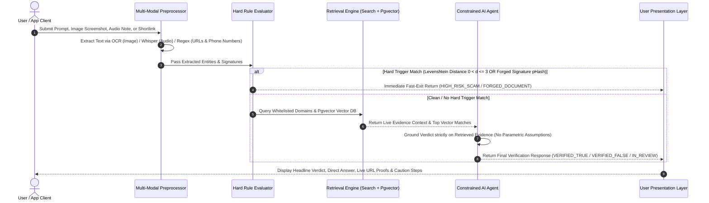

# 3. System Flowcharts & Execution Paths

This document provides detailed sequence diagrams, execution flowcharts, and branch handling for the **VeriFeed Malawian Information Verification, Truth Engine, and Fraud Prevention Platform**.

---

## 3.1 End-to-End System Execution Flow

```
[ User Input (Prompt / Image / Audio / SMS) ]
                     │
                     ▼
       ┌───────────────────────────┐
       │ Multi-Modal Preprocessor  │ ──► Run OCR / Speech-to-Text / Regex Extraction
       └─────────────┬─────────────┘
                     │
                     ▼
       ┌───────────────────────────┐
       │   Hard Rule Evaluator     │ ──► Checks Lookalike Domains / Scam Numbers / Signature Forgery
       └─────────────┬─────────────┘
                     │
         ┌───────────┴───────────┐
         ▼                       ▼
  [ Hard Flag Found ]   [ No Hard Flag ]
         │                       │
         │                       ▼
         │           ┌───────────────────────────┐
         │           │   Live Search & Vector    │ ──► Search Live Whitelisted Domains
         │           │      Retrieval Engine     │     and Pgvector Index
         │           └───────────┬───────────────┘
         │                       │
         └───────────┬───────────┘
                     │
                     ▼
       ┌───────────────────────────┐
       │  Constrained AI Agent     │ ──► Synthesizes verdict, reasoning, and live links
       └─────────────┬─────────────┘
                     │
                     ▼
       ┌───────────────────────────┐
       │ User Presentation Layer   │ ──► Displays Clear Verdict + Direct URL Proofs
       └───────────────────────────┘
```

---

## 3.2 Detailed Sequential Flowchart (Mermaid)



---

## 3.3 Branching Decision Tree

| Input Condition | Evaluator Rule | Execution Path | Verdict Outcome |
| :--- | :--- | :--- | :--- |
| Spoofed URL (e.g. `tnm-promo.com`) | Levenshtein dist $0 < d \le 3$ to official domain | Fast Exit | `HIGH_RISK_SCAM` (Confidence 1.00) |
| Press release with altered text but valid official crest | pHash matches signature seal, OCR body text missing from index | Fast Exit | `FORGED_DOCUMENT` (Confidence 1.00) |
| Claim matches official ministry announcement on `gov.mw` or `times.mw` | Live search & Pgvector return verified grounding links | AI Agent Grounding | `VERIFIED_TRUE` (Confidence 0.90+) |
| Rumor refuted by official statements or police reports | Live search returns refutation news | AI Agent Grounding | `VERIFIED_FALSE` (Confidence 0.90+) |
| Unverified social media post with zero web coverage | No matching articles or statements found in whitelisted index | AI Agent Safety | `IN_REVIEW` (Confidence 0.00) |
